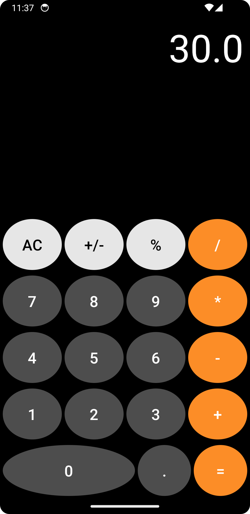

# Calculator_Android_App
Basic and scientific android calculator app with unit testing all written using Kotlin
 

## Portrait Layout -- Basic Calculator

 

## Landscape Layout -- Scientific Calculator

 

## Unique Features
* Uses [EvalEx](https://github.com/uklimaschewski/EvalEx)
  * [EvalEx](https://github.com/uklimaschewski/EvalEx) is a handy expression evaluator for Java, that allows to evaluate simple mathematical and boolean expressions
  * Finding this tool was a big relief because it uses BigDecimal precision.  I was using [exp4j](https://github.com/fasseg/exp4j), but the double precision led to floating point rounding errors.
  * Calculations based on text input.  Uses [Reverse Polish Notation (RPN)](https://en.wikipedia.org/wiki/Reverse_Polish_notation).
  * Unicode reference for special characters [Uni codes wikipedia](https://en.wikipedia.org/wiki/List_of_Unicode_characters)
* Has two different layouts for portrait and landscape.  I had a hard time finding code examples on the internet that had both these features
* Attempting to include unit testing because it was very difficult to find good articles explaining how to do these.  **(still in development)**
   
