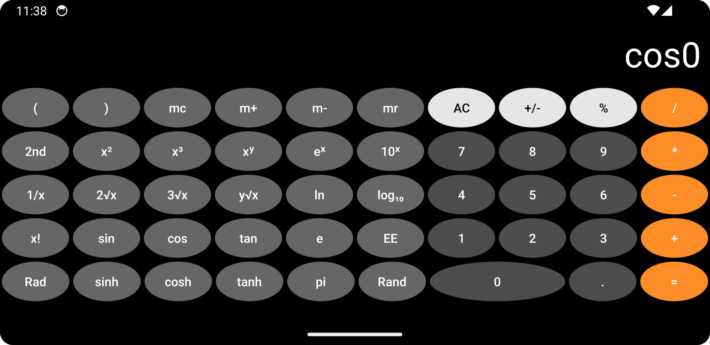

# Calculator_Android_App
Basic and scientific android calculator app using Kotlin
 

## Portrait Layout -- Basic Calculator

  

 

## Landscape Layout -- Scientific Calculator

  

 

## Unique Features
* Uses 
  * Complete implementation of simple and scientific operations without using any third-party library.
  * All functions performed using built-in math operations (Kotlin.math).
  * A big hand to [Geeks for Geeks](https://www.geeksforgeeks.org/how-to-make-a-scientific-calculator-android-app-using-android-studio/) for helping to provide ideas on functionalities.
  * Calculations based on text input.  Uses [Reverse Polish Notation (RPN)](https://en.wikipedia.org/wiki/Reverse_Polish_notation).
  * Unicode reference for special characters: [Uni codes wikipedia](https://en.wikipedia.org/wiki/List_of_Unicode_characters)
* Two different layouts for portrait and landscape orientations. It was challenging to find code examples on the internet that included both features.
* Attempting to include unit testing, which has been very difficult due to the lack of good articles explaining how to do this.  **(still in development)**
   
